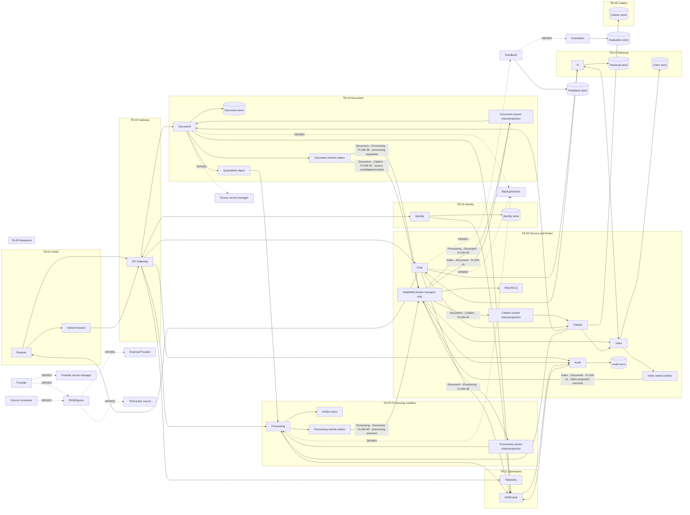

# Threat data flow — design only

Core lines are solid; LATER paths are dashed and default denied. This is not an implementation claim.

## Registry flow table
| Flow IDs | Data / sensitivity | Primary control |
|---|---|---|
| FLOW-01, FLOW-02, FLOW-03, FLOW-31 | gateway ingress and routed PDF/bearer; PII/secret body forbidden | CTRL-AUTH-003 |
| FLOW-04, FLOW-05 | isolated local/demo identity and service context; secret body forbidden | CTRL-AUTH-003 |
| FLOW-06, FLOW-07, FLOW-08 | quarantine/original/artifact; PII body forbidden | CTRL-UPLOAD-001 |
| FLOW-09, FLOW-10, FLOW-11 | schema/type/hash/revision only; no body/DLQ body | CTRL-EVENT-001 |
| FLOW-12, FLOW-13, FLOW-14, FLOW-15, FLOW-35 | published references, retrieval context, evidence/sufficiency/refusal | CTRL-RAG-002 |
| FLOW-16, FLOW-17, FLOW-18, FLOW-36 | Chat→Citation opaque context; Index/Document/Processing validation | CTRL-CITE-001 |
| FLOW-19 | public answer/refusal and citation | CTRL-CITE-002 |
| FLOW-20, FLOW-21 | sanitized audit / redacted telemetry | CTRL-AUDIT-001 |
| FLOW-22, FLOW-23 | LATER backup/DR; DENIED_NOT_SENT, REQ-OPS-002 | CTRL-PRIV-003 |
| FLOW-24 | Core scoped cryptographic-operation metadata; no raw key | CTRL-KEY-001 |
| FLOW-25, FLOW-26, FLOW-37 | LATER provider endpoint/content/secret; DENIED_NOT_SENT | CTRL-PRIV-004 |
| FLOW-27, FLOW-28 | LATER feedback/evaluation; DENIED_NOT_SENT | CTRL-RELEASE-001 |
| FLOW-29, FLOW-30, FLOW-38 | LATER source endpoint/content/secret; DENIED_NOT_SENT | CTRL-SOURCE-001 |
| FLOW-32, FLOW-33, FLOW-34 | gateway→Processing job query, Audit query, Chat question route | CTRL-AUTH-003 |
| FLOW-39, FLOW-40, FLOW-41, FLOW-42 | broker-mediated directed safe event metadata only: IDs, hashes, revisions; producer outbox to consumer inbox/projection | CTRL-EVENT-001 |

The complete source, destination, protocol, class, retention, protection, and owner fields are authoritative in `contracts/security/privacy-data-map.yaml`.
